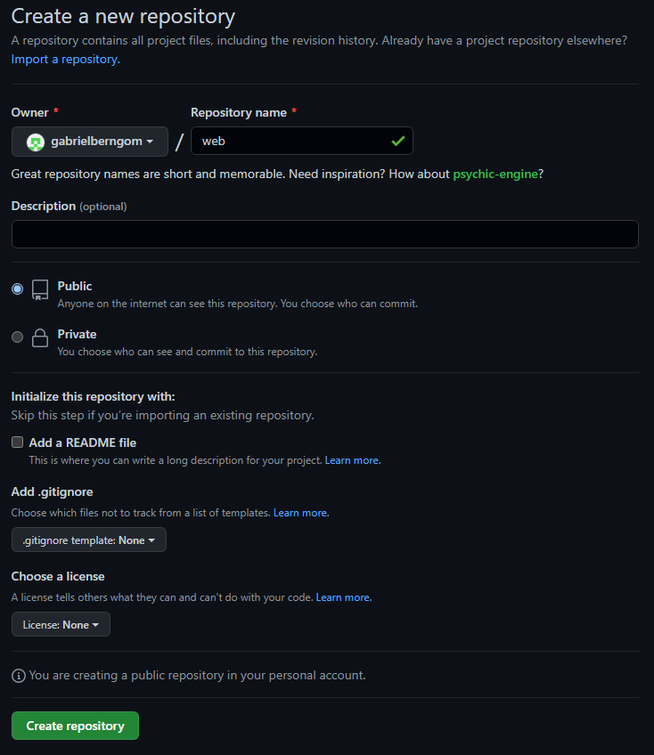

# Explicacion tarea aplicacion web

[Mi pagina web en github](https://gabrielberngom.github.io/aplicacion-web/)

### La realizacion es simple, lo explicaré mediante pasos:

## 1- Creamos un repositorio, el cual no tendrá un readme.md por lo que no seleccionaremos este apartado a la hora de crear el repositorio

## 2- Una vez creado, seleccionamos crear un nuevo archivo 

## 3- A la nueva página le damos el nombre index.html, es necesario que este sea su nombre, ya que es el establecido para paginas web. A continuación añadimos el esquema de html.

## 4- Una vez completado, seleccionamos branch, y creamos un nuevo branch con el nombre gh-pages.

## 5- A continuación, en código, seleccionamos setings en la parte superior, a continuacion seleccionamos branches y en default branch lo cambiamos por gh-pages, actualizamos.

##6- Para terminar, seleccionamos pages y en ella a parece la dirección de nuestra pagina.

